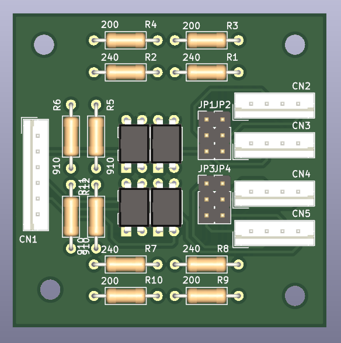

# Dance Maniax Repo

A collection of Dance Maniax related items, both from the arcade cabinet and DIY.

**Disclaimer:** I am measuring all these parts by hand, so they may not be 100% accurate (although I try hard). There's no warranty given to anything contained in this repo, so use at your own risk!

## CAD

So far, I only have CAD of the lower sensor assembly. It's uploaded in \*.f3z and \*.stp file.

For planning purposes, I've also included the following image for approximate sensor locations, relative to each other.

## Boards

Likewise, only the boards in the sensor assembly have been reverse engineered.

GX874-PWB(J) is the board which diverts power to the LEDs.

GX874-PWB(I) provides a mounting point for the LEDs and their connector.

